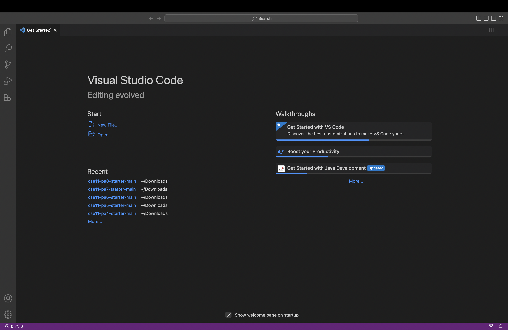
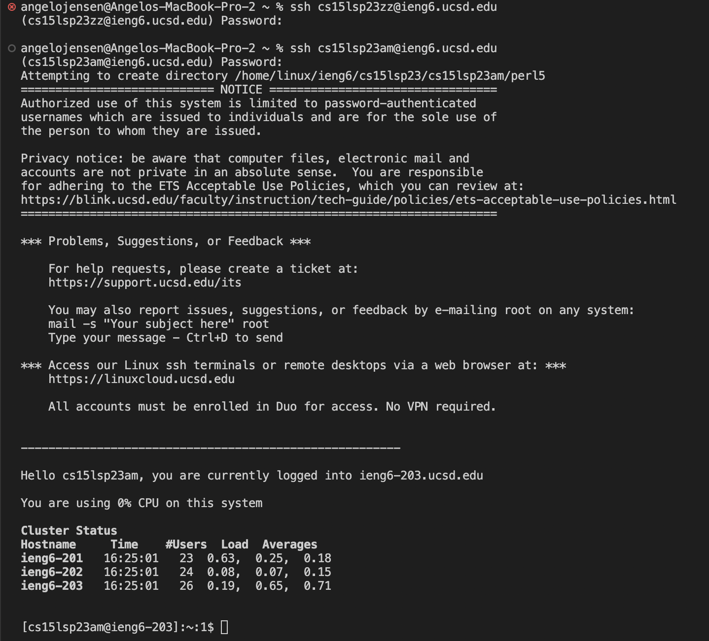
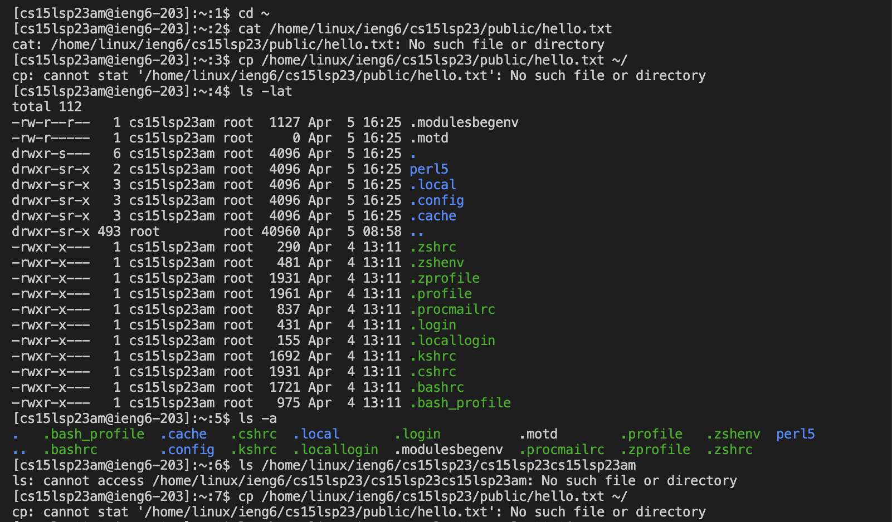

# Course Enrollment Tutorial
**Step 1: Installing VS code**

-To start off go, to Visual Studio code website:

[VS Website](https://code.visualstudio.com/)

-From there simply follow the instructions to download it onto your computer, there will be different versions provided based on the type of computer you have(mac, windows, etc.)

-Once installed, the window you open should look like this(this is how mine looked once I installed it):

**Step 2: Remote Connecting**

-To start off, you need to know that courses in CSE use course specific accounts. You will see how VScode/terminal connects to a remote computer over the internet in order to do the work there. For those in windows, you will need to install git.

-To use ssh, I opened a terminal in VScode and typed(Replace zz with your own account letters)

····ssh cs15lsp23zz@ieng6.ucsd.edu

-Then after recieving a message to connect to the servers I typed in yes and then inputted my password. Once I logged in any commands I ran/you will run will be on the remote server. Any errors encountered you should screenshot and described in your groups notes.

-Once you login this is how your screen should look:

**Step 3: Trying Some Commands**

-You can run commands on both your computer and remote computer after ssh-ing. As I did, this is done through the use of the terminal in VScode.

-Some specific commands you can use are:
  ····cd ~
  ····cd
  ····ls -lat
  ····ls -a
  ····cp /home/linux/ieng6/cs15lsp23/public/hello.txt ~/
  
-Here is what your screen should look like when trying commands out:

